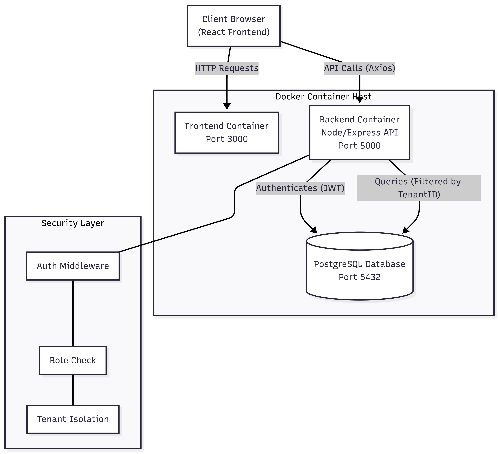
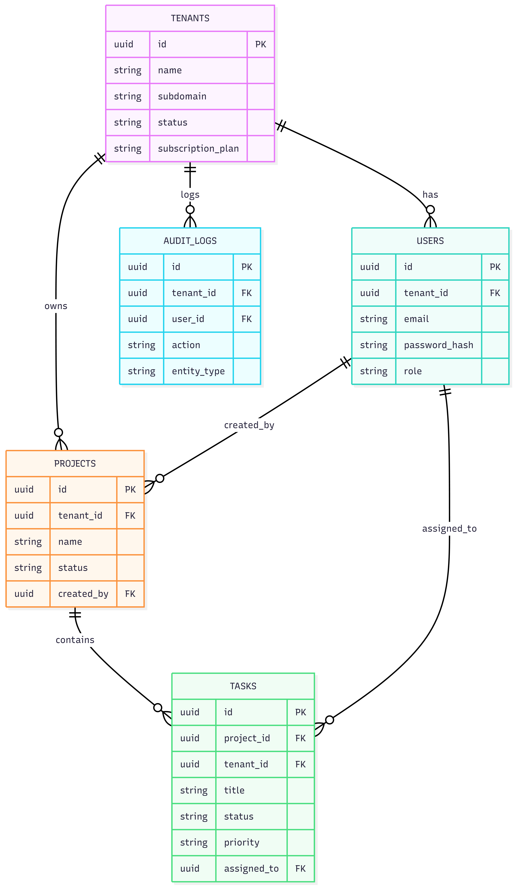

# System Architecture Document

## 1. System Architecture Diagram

### Description
The system follows a containerized 3-tier architecture:
1.  **Client Layer:** React.js Single Page Application (SPA) running in the user's browser.
2.  **Application Layer:** Node.js/Express REST API running in a Docker container. Handles business logic, authentication, and multi-tenancy enforcement.
3.  **Data Layer:** PostgreSQL database running in a Docker container. Stores all tenant data in a shared schema with strict row-level isolation via `tenant_id`.

**Data Flow:**
* Requests are sent from Frontend to Backend via HTTP/JSON.
* Backend verifies JWT Token and extracts `tenant_id`.
* Backend appends `WHERE tenant_id = ?` to all database queries.
* Database returns isolated data to Backend, which sends JSON response to Client.

---

## 2. Database Schema Design (ERD)

### Schema Overview
The database uses a **Shared Database, Shared Schema** approach.
* **Tenants Table:** Stores organization details (`subdomain`, `subscription_plan`).
* **Users Table:** Stores credentials and links to `tenants`. Unique constraint on `(tenant_id, email)`.
* **Projects & Tasks:** Core business data, strictly linked to `tenants`.
* **Audit Logs:** Records all critical write operations for security and compliance.

**Key Relationships:**
* `Tenants` (1) --- (N) `Users`
* `Tenants` (1) --- (N) `Projects`
* `Projects` (1) --- (N) `Tasks`

---

## 3. API Architecture

The system exposes **19 RESTful endpoints**. All endpoints return data in a standard format: `{ success: boolean, message?: string, data?: object }`.

### Module 1: Authentication
| Method | Endpoint | Auth Required | Role Required | Description |
| :--- | :--- | :--- | :--- | :--- |
| `POST` | `/api/auth/register-tenant` | No | Public | Registers a new tenant and admin user. |
| `POST` | `/api/auth/login` | No | Public | Authenticates user and returns JWT. |
| `GET` | `/api/auth/me` | Yes | Any | Returns current user and tenant info. |
| `POST` | `/api/auth/logout` | Yes | Any | Logs out the user (client-side token removal). |

### Module 2: Tenant Management
| Method | Endpoint | Auth Required | Role Required | Description |
| :--- | :--- | :--- | :--- | :--- |
| `GET` | `/api/tenants/:id` | Yes | Super Admin or Tenant Admin (Self) | Get details of a specific tenant. |
| `PUT` | `/api/tenants/:id` | Yes | Super Admin or Tenant Admin (Name only) | Update tenant details. |
| `GET` | `/api/tenants` | Yes | **Super Admin** | List all registered tenants. |

### Module 3: User Management
| Method | Endpoint | Auth Required | Role Required | Description |
| :--- | :--- | :--- | :--- | :--- |
| `POST` | `/api/users` | Yes | Tenant Admin | Create a new user in the current tenant. |
| `GET` | `/api/users` | Yes | Any (Same Tenant) | List all users in the current tenant. |
| `PUT` | `/api/users/:id` | Yes | Tenant Admin | Update user details (Role/Name). |
| `DELETE` | `/api/users/:id` | Yes | Tenant Admin | Remove a user from the tenant. |

### Module 4: Project Management
| Method | Endpoint | Auth Required | Role Required | Description |
| :--- | :--- | :--- | :--- | :--- |
| `POST` | `/api/projects` | Yes | Any | Create a new project (Checks plan limits). |
| `GET` | `/api/projects` | Yes | Any | List all projects for the tenant. |
| `PUT` | `/api/projects/:id` | Yes | Creator / Tenant Admin | Update project details. |
| `DELETE` | `/api/projects/:id` | Yes | Creator / Tenant Admin | Delete a project and cascade tasks. |

### Module 5: Task Management
| Method | Endpoint | Auth Required | Role Required | Description |
| :--- | :--- | :--- | :--- | :--- |
| `POST` | `/api/projects/:id/tasks` | Yes | Any | Create a new task in a project. |
| `GET` | `/api/projects/:id/tasks` | Yes | Any | List all tasks in a project. |
| `PATCH` | `/api/tasks/:id/status` | Yes | Any | Update task status (Todo/In Progress/Done). |
| `PUT` | `/api/tasks/:id` | Yes | Any | Update full task details (assignee, due date). |